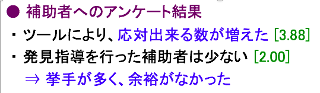

# arrow

## 文字

|矢印文字|文字コード|意味|用途|
|:---:|:---:|:---:|:---:
|⇒|`U+21D2`  `$ echo "\U21D2"`|ならば  よって つまり|XXX することが可能  よって ~~~~ みたいな感じで使う|

> 

  - s13t210 2017年度01月版 `卒論発表` から

- - -

**[↩ Back to Index](../../README.md)**
