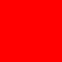
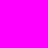
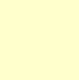
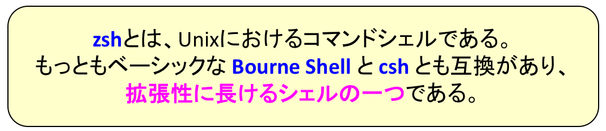
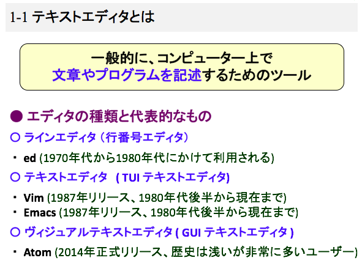
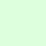
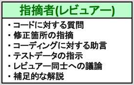

# colors

## 文字色

|名前|色|カラーコード|用途|対象|
|:---:|:---:|:---:|:---:|:---:|
|赤色文字||`#FF0000`|警告|フレーズ|
|桃色文字||`#FF00FF`|重要|キーワード|
|青色文字||`#0000FF`|強調|キーワード|
|緑色文字||`#006600`|強調|具体例|
|紫色文字||`#660066`|強調|見出|
|茶色文字||`#CC9900`|補助|色が不足時に利用|

## 背景色

### 黄色背景

|色|カラーコード|用途|
|:---:|:---:|:---:|
||`#FFFFCC`|定義付け、吹出し|

- Ex.

> 

  - s12t241 2017年度01月版 `zshの概要` から

### 灰色背景

|色|カラーコード|用途|
|:---:|:---:|:---:|
||`#F2F2F2`|定義付け、すでに黄色背景が存在するとき利用、各ページのヘッダにもこの色を使う|

- Ex.

> 

  - s12t241 2016年度10月版 `Vim-conf 参加報告` から

### 桃色背景

|色|カラーコード|用途|
|:---:|:---:|:---:|
||`#FFDDFF`|強調、新規提案|

- Ex.

> PLEASE YOUR PULL REQUEST 😎

### 水色背景

|色|カラーコード|用途|
|:---:|:---:|:---:|
||`#E3FFFF`|対比、緑色背景と合わせて使う|

- Ex.

> 

  - s14t212 2017年度09月版 `中間発表から`

### 緑色背景

|色|カラーコード|用途|
|:---:|:---:|:---:|
||`#DDFFDD`|対比、水色背景と合わせて使う|

- Ex.

> 

  - s14t212 2017年度09月版 `中間発表から`

- - -

**[↩ Back to Index](../../README.md)**
