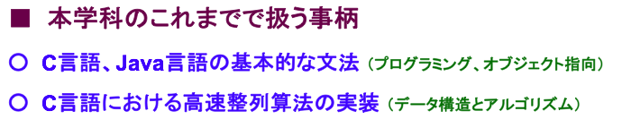
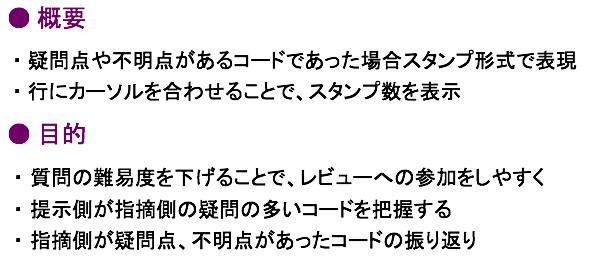

# HeadLineStyle

|名前|利用文字|色|カラーコード|文字サイズ|文字コード|
|:---:|:---:|:---:|:---:|:---:|:---:|
|大見出|■||#660066|32px~28px|`0xE296A0`|
|大見出|●||#660066|28px~24px|`0xE2978F`|
|大項目|◎||#0000FF|28px~24px|`0xE2978E`|
|小項目|○||#0000FF|24px~20px|`0xE2978B`|

- Ex.1

- - -

- Ex.2

- - -

**[↩ Back to Index](../../README.md)**
